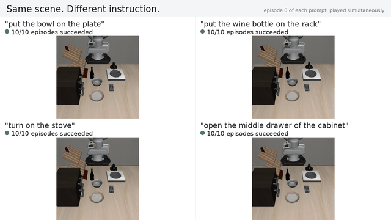

# openpi language-steerability demo

One simulated scene, different language instructions, different robot
behavior — and an honest look at where it stops working.



## What this is

[openpi](https://github.com/Physical-Intelligence/openpi) is Physical
Intelligence's open-source release of its π₀ family of vision-language-action
models. This demo runs the public **`pi05_libero`** checkpoint
(`gs://openpi-assets/checkpoints/pi05_libero`, π₀.₅ fine-tuned for the
[LIBERO](https://github.com/Lifelong-Robot-Learning/LIBERO) benchmark) in the
**LIBERO `libero_goal` scene**, gives it different instructions in the *same*
starting scene, and reports success rates measured by the simulator's own
goal checks.

This project uses **only public code and public checkpoints**: the openpi
repository (Apache 2.0; model weights additionally under the Gemma Terms of
Use, since π₀.₅ builds on PaliGemma), the LIBERO benchmark (MIT), and the
checkpoint above. openpi is used as an unmodified, pinned dependency
(`scripts/setup_openpi.sh`); nothing proprietary or internal is involved.

## The two prompt groups

The checkpoint was fine-tuned on the converted
`libero_spatial + libero_object + libero_goal + libero_10` suites — 40 tasks —
with each task's language string used verbatim as the training prompt
(openpi's LIBERO data config sets `prompt_from_task=True`). That makes group
membership checkable, not a judgment call: `make check`
(`scripts/check_prompts.py`) asserts every in-distribution prompt equals one
of the 40 training strings and every novel prompt equals none of them.

All ten `libero_goal` tasks define the *identical* scene (black bowl, plate,
cream cheese box, wine bottle, cabinet with drawers, stove, wine rack) and
differ only in language and goal predicate — which is what makes a
same-scene steering demo possible.

**In-distribution** (verbatim `libero_goal` training instructions):

- "put the bowl on the plate"
- "put the wine bottle on the rack"
- "turn on the stove"
- "open the middle drawer of the cabinet"

**Novel** (same scene; in none of the 40 training strings):

- "place the black bowl on top of the plate" — *paraphrase* of a trained
  task; scored with that task's original goal check. (Similar wording exists
  in `libero_spatial`, but in a different scene.)
- "put the cream cheese on the plate" — *recombination*: trained object,
  trained target, untrained pairing.
- "put the wine bottle on the stove" — *recombination*.
- "turn on the stove and put the bowl on the stove" — *combined steps*: two
  trained single-step tasks in one instruction. (`libero_10` contains
  "turn on the stove and put the moka pot on it" — different scene and
  object.)

Novel goals are scored by LIBERO's own BDDL goal evaluator via custom task
files (`bddl/`, generated by `scripts/gen_bddl.py`) that copy the
`libero_goal` scene verbatim and change only the `:goal` predicate. No
success or failure is ever judged by eye.

## Results

<!-- RESULTS_TABLE_START -->
*Not yet run — this table is filled in from `results/summary.json` by
`python scripts/readme_table.py` after `make rollouts` completes.*
<!-- RESULTS_TABLE_END -->

Model: `pi05_libero` · Simulator: LIBERO (`libero_goal` scene) · Full video:
`media/demo.mp4` (built by `make video`).

## Protocol (no cherry-picking)

- **N = 10 episodes per prompt**, episodes indexed 0–9.
- Episode *k* of **every** prompt starts from LIBERO's precomputed initial
  state *k* of the anchor task (`put_the_bowl_on_the_plate`), so all prompts
  see the same starting scenes; the environment seed is fixed at 0. These are
  the only randomness sources on the simulator side.
- The control loop is openpi's own LIBERO eval loop (same image
  preprocessing, same state vector, replan every 5 steps, 300-step horizon;
  520 for the two-step novel prompt, matching openpi's `libero_10` horizon).
- Every episode's success comes from the environment's BDDL goal check and is
  logged to `results/log.jsonl`; `results/summary.json` aggregates it. Every
  number and label in the video and this README is read from those logs.
- Each video panel shows **episode 0** for that prompt — first by seed order,
  never the best-looking one.

If the novel prompts mostly fail, that is the finding, and it is shown as-is.

## Running it

Requirements: Linux (tested target: Ubuntu 22.04 under WSL2), an NVIDIA GPU
with **more than 8 GB of VRAM free** (openpi's documented inference
requirement), [uv](https://docs.astral.sh/uv/), and ffmpeg-capable Python
(imageio-ffmpeg is installed by the client env).

```bash
make setup     # once: clones pinned openpi + builds server and client envs
make serve     # terminal 1: checks free VRAM, then serves pi05_libero
               # (first run downloads the checkpoint, several GB)
make rollouts  # terminal 2: regenerates BDDL, verifies prompt groups,
               # runs 8 prompts x 10 episodes; resumable if interrupted
make video     # builds media/demo.mp4 (1080p30) and media/shot1.gif
python scripts/readme_table.py   # refresh the table above from the logs
```

`make serve` refuses to start if less than ~8.5 GB of VRAM is free and
prints the actual numbers, so you know what to close. If MuJoCo rendering
fails with EGL errors in the client, use `make rollouts MUJOCO_GL=osmesa`.

Sanity checks without a GPU: `make mock-server` serves random actions over
the same websocket protocol, and `make smoke` runs 2 episodes per prompt
against whatever server is up, writing to `results-smoke/`.

## Layout

```
prompts.yaml            prompt spec: text, group, goal predicate, rationale
bddl/                   generated novel-goal BDDL files (scene copied from LIBERO)
scripts/run_rollouts.py rollout client (websocket -> policy server)
scripts/make_video.py   grid shots + closing table from logged data
scripts/check_prompts.py  verifies prompt-group claims against LIBERO
results/                log.jsonl, summary.json, per-episode videos
vendor/openpi           pinned upstream clone (gitignored, never modified)
```
